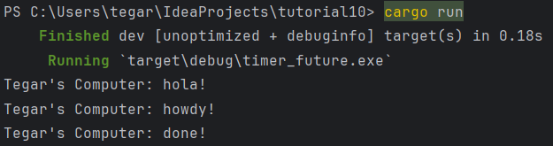
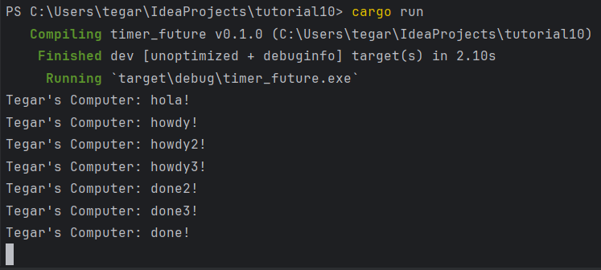

# Module 10 - Reflection
> Tegar Wahyu Khisbulloh (2206082032) - Pemrograman Lanjut A

## 1.2 Understanding how it works

Dalam gambar tersebut, kode pertama-tama mencetak "hola!" di main thread sebelum
memulai task execution. "howdy!" dicetak setelahnya karena bagian dari task yang dihasilkan
secara asynchronous. Meskipun "hola!" dan "howdy!" berada dalam queue, "hola!" dieksekusi
terlebih dahulu karena dicetak secara synchronous oleh main thread sebelum executor mulai
menjalankan task.
Berikut adalah urutan eksekusi kode:
1. Method `main` mulai dieksekusi.
2. Inisiasi `Executor` dan `Spawner`.
3. Sebuah task di-spawn menggunakan `spawner.spawn(async { /* ... */ })`.
4. Setelah me-spawn task, "hola!" di-print oleh `main`.
5. Spawner di-drop, menandakan tidak ada task yang akan di-spawn lagi
6. `executor.run()` dipanggil, mengeksekusi task yang ada di queue.

## 1.3 Multiple Spawn and removing drop

Pada gambar di atas, output yang dihasilkan ketika dilakukan multiple spawn tetap diprint
setelah "hola!". Akan tetapi, urutan eksekusi akan menjadi random karena setiap task dijalankan
secara asynchronous dan independen. Kemudian, apabila menghapus perintah `drop` program akan
berjalan terus karena program tidak mengetahui bahwa tidak ada task yang akan dijalankan lagi.